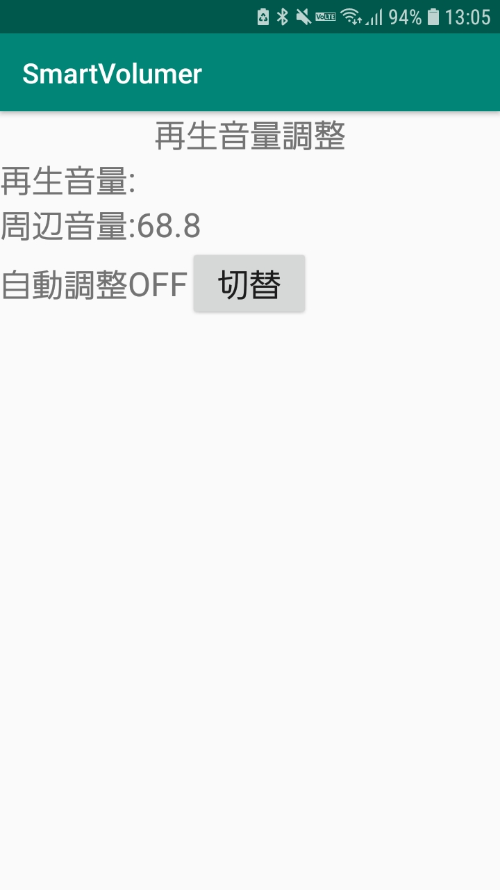
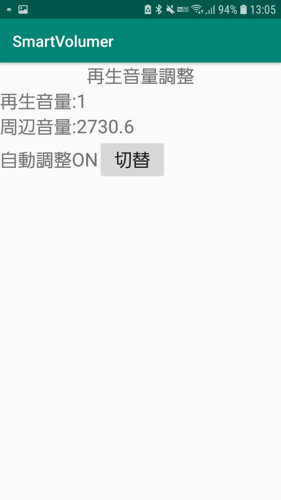

# SmartVolumer
スマホの音楽再生の音量を，周囲の騒音より少し大きい程度に自動調整してくれるアプリ

## 開発の背景
電車の中など，移動しながら音楽を聴いているとき，周囲が静かだったりうるさかったりする．うるさいときは音量を大きくしないと音楽が聴けず，静かなときに必要以上に大音量で音楽を聴きたくない．

そこで，マイクを使って騒音の大きさを読み取り，音量を自動で調整するアプリを作成することにした．

## 使用方法

起動すると，マイクへのアクセスを求められた後，以下の画面が開く．  
マイクの使用を許可することで，周辺音量の大きさが100ミリ秒ごとに表示される．  

  

この状態で，"切替"ボタンを押すことで，音量の自動調整を開始することができる．  
自動調整をオンにすると，画面上にその旨が表示されるとともに，現在の再生音量が確認できるようになる．  

  

自動調整機能はバックグラウンドでも動作する．この機能をオンにしたことを忘れないよう，オンにしている間はその旨を通知欄に固定表示する．

  
